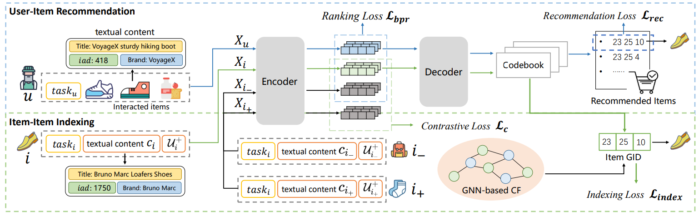

# ColaRec

This is the official implementation for the CIKM 2024 paper "Content-Based Collaborative Generation for Recommender Systems" [[PDF](https://dl.acm.org/doi/10.1145/3627673.3679692)].


## Introduction

Colarec is a model that unifies both item content information and user-item collaborative signals in a sequence-to-sequence generation framework which is tailored for the recommendation task. Here is the Overview of ColaRec.



## Requirements
'''
pytorch == 1.12.1
transformers == 4.30.2
k-means-constrained == 0.7.3
accelerate == 0.21.0 
'''


## Usage

### Training
'''sh
python model_train.py --info="phone-short-model-gen008-cl01" --seq_type="short" --dataset="phone" --cid_token_num=32 --batch_size=128 --generate_lamda=0.08 --content_cl_lamda=0.1
'''

### Evaluation
'''sh
python model_eval.py --eval_model_mkdir="" --dataset="phone" --seq_type="short" --n_epochs=100 --start=1 --eval_batch_size=20
'''

eval_model_mkdir denotes to the path in which the trained model is stored.

### others
* Code for hierarchical clusting to conduct GID: `hierarchical_cluster.py`

## Citation

If you find our code or work useful for your research, please cite our work.
```
@inproceedings{wang2024content,
  title={Content-Based Collaborative Generation for Recommender Systems},
  author={Wang, Yidan and Ren, Zhaochun and Sun, Weiwei and Yang, Jiyuan and Liang, Zhixiang and Chen, Xin and Xie, Ruobing and Yan, Su and Zhang, Xu and Ren, Pengjie and others},
  booktitle={Proceedings of the 33rd ACM International Conference on Information and Knowledge Management},
  pages={2420--2430},
  year={2024}
}
```

The code is implemented based on [GenRet](https://github.com/sunnweiwei/GenRet)